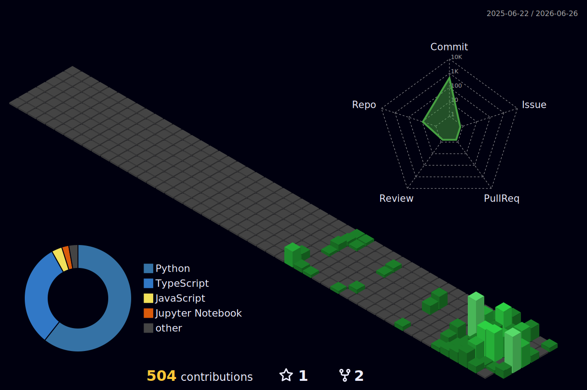

<!-- ============================================================ -->
<!--                          HERO                                -->
<!-- ============================================================ -->

  

<!-- ============================================================ -->
<!--                        ABOUT  ME                             -->
<!-- ============================================================ -->

## About Me

<table>
<tr>
<td width="42%" align="center">
  
</td>
<td width="58%" valign="top">
  
I'm <b>Sreyash</b> &mdash; a developer who lives between <b>servers and neural nets</b>.

  <ul>
    <li><b>Backend Developer</b> building scalable APIs and event-driven systems</li>
    <li><b>ML / Deep Learning Engineer</b> with a focus on <b>NLP</b></li>
    <li>Currently shipping projects around <b>LLMs, RAG pipelines and Transformers</b></li>
    <li>Exploring <b>distributed systems, Kafka pipelines and MLOps</b></li>
    <li>Learning <b>System Design and Scaling Techniques</b></li>
  </ul>
</td>
</tr>
</table>

<!-- ============================================================ -->
<!--                       SKILLS & TOOLS                         -->
<!-- ============================================================ -->

## Skills &amp; Tools

<table width="100%">
<tr><td>

#### Programming &amp; Scripting

</td></tr>
</table>

<table width="100%">
<tr><td>

#### Frontend

</td></tr>
</table>

<table width="100%">
<tr><td>

#### Backend &amp; Systems

</td></tr>
</table>

<table width="100%">
<tr><td>

#### AI / ML &amp; Deep Learning

</td></tr>
</table>

<table width="100%">
<tr><td>

#### Databases

</td></tr>
</table>

<table width="100%">
<tr><td>

#### DevOps &amp; Cloud

</td></tr>
</table>

<!-- ============================================================ -->
<!--                       GITHUB  STATS                          -->
<!-- ============================================================ -->

## GitHub Stats

<table>
<tr><td align="center">

</td></tr>
</table>

 

<table>
<tr><td align="center">

</td></tr>
</table>

 

<table>
<tr><td align="center">

</td></tr>
</table>

<!-- ============================================================ -->
<!--                          CONNECT                             -->
<!-- ============================================================ -->

## Let's Connect

  

 

  <i>Build. Train. Deploy. Repeat.</i>

